# PHP 编码审查标准

[TOC]

文档最后更新：2020年5月6日

## 前言

编写本手册目的在于：
- 规范程序开发人员代码编写行为 ；
- 减少开发、测试、生产环境编码缺陷 ；
- 提供研发质量考核参考标准。

当前编码检查语言遵循 [RFC2119](http://rfc.net/rfc2119.html) ([中文版](assert/rfc2119.md))标准，文中将出现：**禁止** 、**推荐**、 **不推荐**、**可以** 等词汇用语。

当前标准应当根据实际团队情况进行更新迭代，避免给实际研发效率带来负面影响。

**🚩建议审查标准为：**

1. 禁止在编码过程中，将包含**禁止**项目的代码流转到测试环节
2. 在时间允许情况，避免使用**不推荐**项目
3. 平日研发活动中，收集更多**推荐**项目代码片段，向开发团队推行。

🌏**检查覆盖范围建议：**

​	一般检查代码以新增代码为主，如团队允许，可以扩展到变更代码行，或更宽涉及面。

## 软件环境
当前编码标准主要针对以下软件版本语法环境：
1. **PHP：7.0+**
2. **HTML：4.0+**
3. **CSS：2.0**，不包含针对特定浏览器、场景进行HACK代码
4. **JavaScript 1.6+**
5. 推荐使用IDE：***PHPStorm***、*Eclipse PHP*、*Aptana Studio*、*Visual Studio* ···。
    使用其他IDE尽量具备同等语法检测能力。 
    不推荐长期使用类似：*Notepad*、*Notepad++*、*Sublime*、*VIM（VI）*、*Emacs*、*ATOM*、*EditPlus*、*UltraEdit*等仅有简单的词法分析的文本编辑器。

**本文档基于PHPStorm语法检测做参考，其他IDE请自行保证相关检查项目是否有效。**

## 检查项目

### 1. 禁止出现代码显式错误

IDE提示内容包含且不止于以下场景：

1. 未实现接口类方法
2. 未定义变量（View模板、eval等特殊场景除外）

案例：


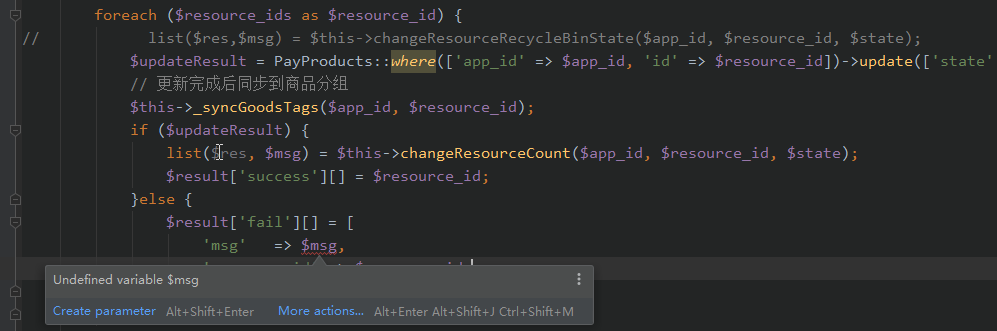

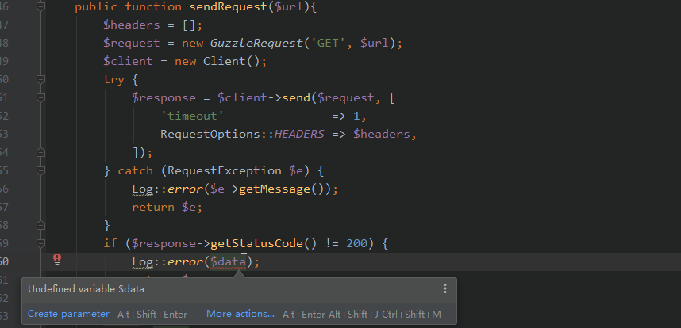


### 2. 禁止出现单词拼写错误

单词拼写检查项目不包含以下情况：

1. 专有名词（如google、sina、xiaoe）
2. 多个单词组合情况（如booklist）
3. 内置函数、类、第三方库中已有词汇（Web环境可参考附件dictionaries）
4. 单词缩写（单词缩写规则请自行参考网上规则）、
5. 精简变量、前缀
6. 混淆字符、密码等特定需要场景。

案例：

```php
"descrb",
@return bool ture 有参与  false 未参与
'algn' => null,
public static function getPrice($app_id, $resouce_id, $resource_type)
const GET_C_USER_BANLANCE = '/get_scholar_balance';
$repet = false;
const INVAID_PARAMETER = -101; // 参数错误
```


### 3. 禁止遗留个人测试代码、废弃代码、废弃（无效）注释等在正常业务逻辑代码中x

开发同学如需在后续找回该部分代码，可通过log追溯。测试代码可能导致生产环境安全事故。
案例：

```php
/**
 * 测试用
 */
public function test(){
    //...
}
```

```php
//测试
Router::get('/resource', function(){
    dd('This is the Resource module index page.');
});
```

```php
//测试用
//       $data = $instance->post(ShopConfigRequest::API_MODULE_SET, [
//            RequestOptions::QUERY => [
//                "app_id"  => $app_id,
//                "modules" => ["pc"=>["is_enable"=>0]],
//            ],
//        ]);dd($data);
```

```php
$task_progress_result = array_column($task_progress_result,null,'resource_id');
//        var_dump($task_progress_result);die;
```

```php
        //查询判断user_id属于哪些人群
        $que_data = CrowdUser::query()
            ->selectRaw('crowd_id, compute_random')
            ->where('app_id', $app_id)
            ->where('user_id', $user_id)
            ->whereIn('crowd_id', $crowd_arr)
            ->where('state', 0)
//            ->whereIn('compute_random', $randoms)
            ->get();
//        var_dump($que_data,$app_id,$user_id,$crowd_arr,$randoms);die;
```

```php
$result = json_decode($ret, true);
//        dump($result);
//        exit;
```

```php
$app_id = AppUtils::getAppID();
$params = Input::get("params");
//        dump(Input::all());
//        die();
```

```php
    /**
     * 内容方收到申请通知
     * @param $channel_app_id 渠道方
     * @param $content_app_id 内容方
     * @param $resource_id 资源
     * @return bool|\Illuminate\Http\JsonResponse
     */
//    public function sendApplyNoticeMsg($channel_app_id, $content_app_id, $resource_id){
//
//        if (empty($channel_app_id)|| empty($content_app_id)|| empty($resource_id)){
//            return false;
//        }
//
//        // 渠道店铺名称
//        $shop_name =  \DB::connection("mysql_config")->table('t_app_conf')
//            ->where('app_id', $channel_app_id)
//            ->where('wx_app_type', '1')
//            ->value('shop_name');
```

```php

    private static function curl_send_get_request($url) {

        $ch = curl_init();
        curl_setopt($ch, CURLOPT_URL, $url);
//        curl_setopt($ch, CURLOPT_POST, 1);
        curl_setopt($ch, CURLOPT_HEADER, 0);
        curl_setopt($ch, CURLOPT_RETURNTRANSFER, 1);
        curl_setopt($ch, CURLOPT_TIMEOUT, 5);//5秒超时
        curl_setopt($ch, CURLOPT_SSL_VERIFYHOST, 0);
        curl_setopt($ch, CURLOPT_SSL_VERIFYPEER, 0);
//        curl_setopt($ch, CURLOPT_POSTFIELDS, http_build_query($biz_data));

        $return = curl_exec($ch);
        if ($return === false) {
            $errno = curl_errno($ch);
            $error = curl_error($ch);
            LogUtils::recordServerApiErrorLog($url, [], $return. " ". $errno. " " . $error, "接口返回false");
        }
        curl_close($ch);

        return $return;
    }
```

```php

    /**
     * t_app_conf拆分  cashe说不用了  哈哈哈
     * @param Request $request
     * @return \Illuminate\Http\JsonResponse
     */
//    public function byPcCode(Request $request){
//        $this->validate($request, [
//            'code' => 'required'
//        ]);
```

```php

class TestController extends Controller
{
	public function phpinfo ()
	{
		phpinfo();
	}

```


如项目有专门用于测试模块、目录，应当将该部分测试代码放入其中，该部分代码不需要定义为个人代码，诸如单元测试代码等。

### 4. 禁止在foreach循环中使用引用方式对元素进行修改

**该编码方式极容易引发变量被篡改。**
原因可参考：https://stackoverflow.com/questions/3307409/php-pass-by-reference-in-foreach

案例：

```php
$a = array ('zero','one','two', 'three');

foreach ($a as &$v) {

}

foreach ($a as $v) {
  echo $v.PHP_EOL;
}
```

### 5. 禁止使用 *number_format* 方法进行数值运算
``number_format()`` 仅用于**数值格式化（如千分位表现）**，常见数值取位逻辑基本会涉及进位问题，因此推荐使用 ``round($val, $precision = 0, $mode = PHP_ROUND_HALF_UP)``函数、或其他数值精度处理函数。

案例：

```php
$number = number_format($orgValue / 100, 2);
$number = str_replace(",", "", $number);
```

### 6. 禁止使用空置try···catch语句，消耗代码性能，浪费代码行数

案例：

``` php
public function __construct($activityType, $oprationApi = [], $openRedis = false){
    try {
    //...
    } catch (Exception $e) {
       throw $e;
    }
}
```

### 7. 禁止代码中出现：未定义常量

PHP针对为定义常量自动转换成字符变量，代码可以正常运行。但为保证代码正确性，
应当禁止该类编码方式。

案例：

```php
//场景1：常量当做字符串使用
$a = $row[name]; //执行效果等同于：$a = $row['name'];
$_ids=$request->get(item_id);
```

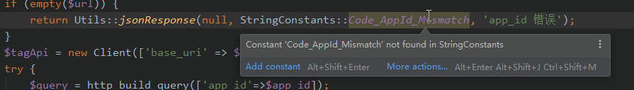

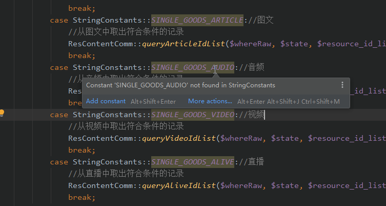

### 8. 禁止代码中出现：未定义函数、未定义类名

IDE识别为：*Undefined class*, *Undefined function*。
该类型错误可能出现在：

1. 代码逻辑块中；
2. PHP 注释语法中；
3. PHP improve语法中。

基于IDE统一识别为：Undefined class, Undefined function，因此建议统一规定。针对情况1、情况3，PHP在部分框架中可能不会导致程序异常，但同样应当规避。
View模板文件中，可列为例外处理。

[^Laravel]: Laravel框架做了部分类名别名功能，该部分代码能正常运行。

案例：

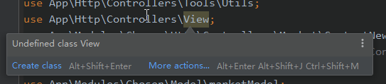


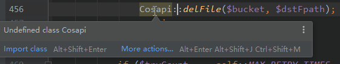

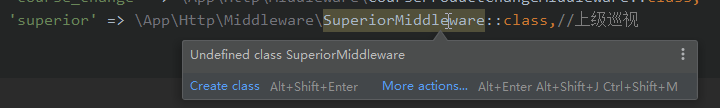

<u>建议：如变量方法为魔术方法、或全局变量，建议使用PHPDoc注释在文件中重新声明。</u>

### 9. 禁止出现逻辑未能到达代码块

该代码块一般为人工变更返回逻辑，而未清理其他相关代码导致。

案例：

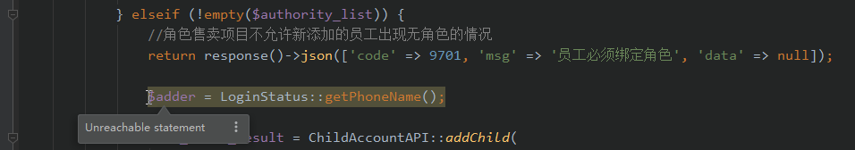


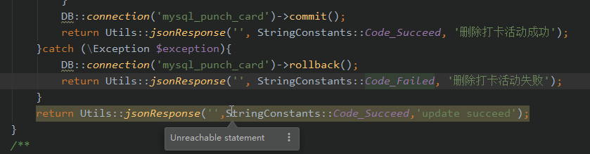


```php
if (!empty($authority_list)) {
    //角色售卖项目不允许新添加的员工出现无角色的情况
    return response()->json(['code' => 9701, 'msg' => '员工必须绑定角色', 'data' => null]);
    $adder = LoginStatus::getPhoneName();
```

### 10. 禁止在URL拼接方法不考虑字符：?与& 检测处理

拼接URL时，不考虑原字符串是否包含?或者&字符，可能会因为路由方式的改变，导致拼接逻辑错误。
案例：

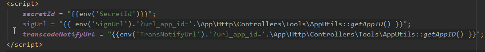


### 11. 禁止在代码公开访问目录遗留有数据泄露风险的文件

文件包含：

- 源代码压缩包，如：source.tar.gz
- SQL数据文件，如：bak.sql
- 临时处理数据文件，如：userlist.txt
- 包含phpinfo()检测代码，如：phpinfo.php
- 未测试隐藏入口脚本，如：back.php
- log日志文件，如：www.a.com-error.log
- 敏感信息配置文件，如：database.php，database.yaml
- 产品、技术相关敏感文档：如：加密协议.doc

### 12. 不推荐在直接使用可枚举值、常用值，应当定成为常量、公共变量

建议：凡是涉及该项的代码，应当在团队的努力下，收敛这种代码的出现。有能力团队可按照实际情况选择优先级进行推行。
案例：


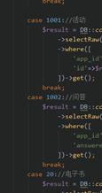


### 13. 不推荐出现变量可能未定义情况

该情况可能存在逻辑上缺失，在特定条件分支中引发代码BUG。

案例：


### 14. 不推荐使用废弃方法、类库等

如方法、属性、类等需要废弃，可通过doc语法 @deprecated进行标记。
原则上：新增代码、涉及变更代码不推荐使用已经废弃代码，避免废弃方法长时间得不到替换机会。
开发同学可以通过查看关联定义，查询最新调用代码。

案例：

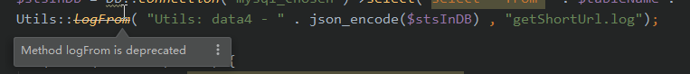

### 15. 不推荐声明未使用变量

该行为将导致程序内存占用增加等因素。

案例：

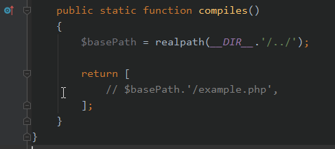


### 16. 不推荐使用与方法、函数、接口声明不一致变量类型、变量数量

案例：

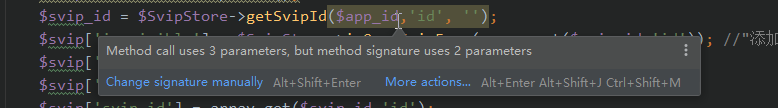


### 17. 不推荐使用 *strtotime("$m month")* 使用月份数来推导时间

由于 -xx month不能计算出准确天数，如在使用过程严格需要计算天数，**推荐**使用 mktime来推导

### 18. 推荐代码检查结果为：🍀绿色通过

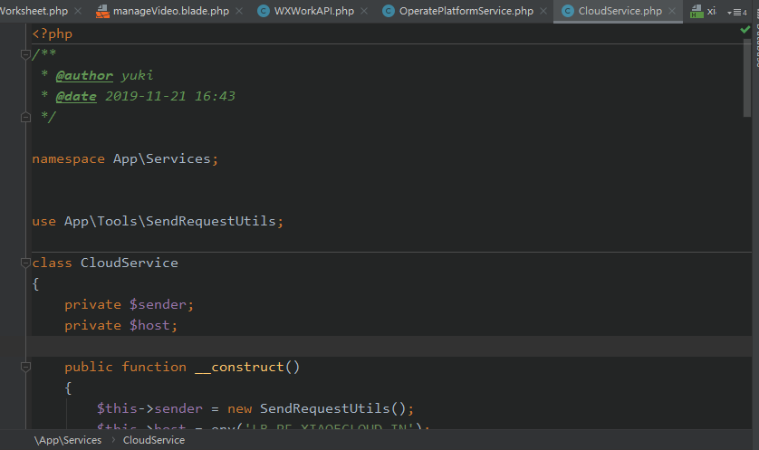